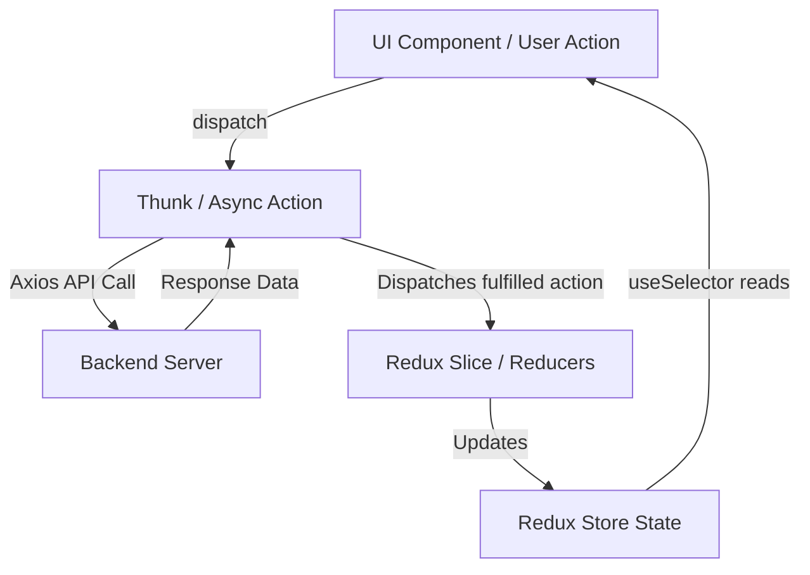

# Employee Management System (React + Redux Toolkit + Vite)

A modern, feature-rich **Employee Management System** built with **React**, **Redux Toolkit (RTK)**, **Tailwind CSS**, and **DaisyUI**.


---

## 🌟 Features & Architecture

This project demonstrates professional state management and modular architecture using Redux Toolkit.

1. **Fetch & Display Employees**: Retrieves employee details from an API via async thunks and renders them in responsive cards.
2. **Add New Employee**: A popup form (`EmployeePopup`) allows users to add new employees, instantly updating the global store and UI.
3. **Highlight/Favorite Feature**: Clickable heart icon on each employee card to toggle highlight status (`highlight: true/false`), dynamically updating the row background and heart styling.
4. **Delete Employee**: Securely remove employees with confirmation support.
5. **Popup Management**: Managed globally via Redux popup slice to control modal open/close states.

---

## 📁 Project Structure

```text
src/
├── components/
│   ├── DeletePopup/     # Confirmation modal for deleting employees
│   ├── EmployeePopup/   # Modal form for adding/editing employees
│   ├── Employees/       # Employee list and individual card components
│   ├── Footer/          # Application footer
│   ├── Layout/          # Main wrapper layout
│   └── NavBar/          # Navigation header
├── store/
│   ├── store.js         # Redux store configuration
│   └── features/
│       ├── employee/
│       │   ├── employee.slice.js  # Redux slice for employee state & reducers
│       │   └── employee.thunk.js  # Async thunks for API calls (GET, POST, DELETE)
│       └── popup/
│           └── popup.slice.js     # Redux slice for modal visibility
├── App.jsx              # Root component
└── main.jsx             # Entry point with Redux Provider
```

---

## 🔄 Redux State Management Flow



---

## 🚀 Getting Started

### 1. Install Dependencies
```bash
npm install
```

### 2. Run Development Server
```bash
npm run dev
```

---

## 💡 Code Highlights

### **Employee Slice (`employee.slice.js`)**
Handles asynchronous data fetching, local mutations (like `toggleHighlight`), and API status handling (`pending`, `fulfilled`, `rejected`).

### **Employee Popup (`EmployeePopup.jsx`)**
Manages local form input state (`useState`) and dispatches `postEmployees` along with `closeEmployeePopup` upon submission.
